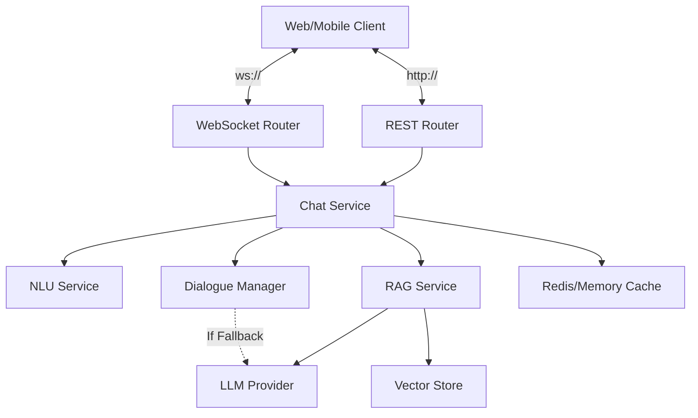

# Nexus AI — Conversational Intelligence Platform


Nexus is a production-grade, asynchronous Conversational AI platform. It combines traditional intent-based dialogue management with modern Retrieval-Augmented Generation (RAG) and LLM fallbacks to provide a resilient, intelligent, and fast conversational agent.

---

## 📖 Project Overview

Nexus is built using a **Hexagonal Architecture (Ports and Adapters)**, ensuring that the core domain logic (NLU, dialogue, reasoning) is completely decoupled from infrastructure concerns (vector stores, databases, external LLM APIs). 

### Key Features:
- **Real-time Chat:** Async WebSockets and REST API support.
- **NLU Pipeline:** Local fast inference for intent classification, entity extraction, and sentiment analysis using HuggingFace models.
- **RAG Integration:** Vector-based search (FAISS/Qdrant) combined with a generator LLM to answer knowledge-based questions.
- **Graceful Fallback:** If the user asks an off-topic question, the system falls back to a generalized LLM (GPT-2, Mistral, OpenAI) to dynamically generate an answer, preventing dead-ends.
- **Immersive UI:** A modern, glassmorphism-styled frontend mimicking frontier AI agents.

---

## 🏗 Architecture



---

## 📂 Folder Structure

```
Nexus-Conversational-AI/
├── frontend/                 # Modern Glassmorphism Web UI
│   ├── index.html            # Main markup
│   ├── styles.css            # Styling and animations
│   └── script.js             # WebSocket & REST logic
├── src/nexus/
│   ├── api/                  # FastAPI app, routes, WebSockets, dependencies
│   ├── application/          # Service layer (Chat, RAG, Session, Ingestion)
│   ├── core/                 # Legacy/Core utilities
│   ├── data/                 # Dialogue templates and definitions
│   ├── dialogue/             # Intent handlers and Dialogue Manager
│   ├── domain/               # Pydantic models, interfaces (Ports)
│   ├── infrastructure/       # Adapters (LLM, Vector Stores, Caching, Auth)
│   └── nlu/                  # NLP models (Intent, Sentiment, Entities)
├── docker-compose.yml        # Multi-container orchestration
├── pyproject.toml            # Dependencies and tools configuration
└── README.md                 # You are here
```

---

## 🚀 Installation & Setup

### Prerequisites
- Python 3.10+
- Docker (optional, for Redis/Qdrant)
- Git

### 1. Clone the repository
```bash
git clone https://github.com/raghavshuklaofficial/Nexus-Conversational-AI.git
cd Nexus-Conversational-AI
```

### 2. Environment Setup
Create a `.env` file in the root directory:
```env
NEXUS_ENVIRONMENT=development
NEXUS_CACHE_BACKEND=memory
NEXUS_VECTOR_STORE_BACKEND=faiss
NEXUS_KAFKA_ENABLED=false
NEXUS_LLM_PROVIDER=local
NEXUS_NLU_DEVICE=cpu
```

### 3. Install Dependencies
```bash
pip install -e ".[dev]"
```
*Note: This installs FastAPI, Transformers, Sentence-Transformers, FAISS, and other core libraries.*

### 4. Start the Application
```bash
python -m uvicorn nexus.api.app:app --host 0.0.0.0 --port 8000
```
Visit `http://localhost:8000` to access the immersive chat interface.

---

## 🧠 Reasoning & Execution Flow

When a message arrives via WebSocket or REST:

1. **Validation & Normalization:** Input is sanitized and session memory is loaded from cache.
2. **NLU Pipeline:** `NLUService` runs the message through a local Sentence-Transformer to classify the intent, extract entities via BERT-NER, and score sentiment.
3. **Routing Strategy:**
   - **RAG Enabled:** If the user toggled deep knowledge, `RAGService` generates embeddings, queries the vector store, and prompts the LLM with the context to generate an answer.
   - **Dialogue Enabled:** If RAG is off, `DialogueManager` attempts to match the intent to a known template (e.g., greeting, joke).
4. **Fallback Mechanism:** If the intent is `fallback` (not understood by templates), the system **routes to the LLM directly**, instructing it to answer the question gracefully (setting intent to `general_qa`). This ensures the bot *always* attempts a real answer instead of repeating "I don't know".
5. **Response Formatting:** Latency is tracked, citations (if any) are appended, and the payload is sent back to the client.

---

## 🛡 Dependency Explanations

- **FastAPI:** Core async web framework handling HTTP and WebSockets.
- **Transformers / Sentence-Transformers:** Local ML inference for embeddings, sentiment, and local text generation (GPT-2 default for local development).
- **FAISS:** Local, fast, in-memory vector store for RAG.
- **Pydantic:** Robust data validation across the domain layer.
- **Structlog:** Structured JSON logging for production observability.

---

## 🛠 Troubleshooting

- **Server hangs on startup:** Downloading the HuggingFace models (BERT, RoBERTa, GPT-2) takes time on the first run. Wait for the `application_ready` log.
- **GPU Out of Memory (OOM):** If using CUDA (`NEXUS_NLU_DEVICE=cuda`), ensure you have at least 8GB VRAM. Fall back to `cpu` in your `.env`.
- **WebSocket Disconnections:** Ensure no proxies (like Nginx) are aggressively closing idle connections without handling ping/pong frames.

---

## 📸 Screenshots

*(Placeholders for future screenshots)*

| Immersive Chat UI | Knowledge RAG System |
|-------------------|----------------------|
|  |  |

---

## ☁️ Deployment Guide

Nexus is production-ready and Dockerized.

```bash
docker-compose up --build -d
```

This will spin up:
1. The **Nexus API** container.
2. A **Redis** container (for robust session cache and message brokering).
3. A **Qdrant** container (for production vector search).
4. **Prometheus / Grafana** for metrics.

*Tip: For production, change `NEXUS_LLM_PROVIDER` to `openai` or configure a dedicated vLLM instance.*

---

## 🔮 Future Improvements

1. **Multi-Agent Orchestration:** Route complex queries to specialized sub-agents.
2. **Tool Use (Function Calling):** Allow the LLM to trigger internal APIs (e.g., checking weather, booking tickets).
3. **Voice Interface:** Integrate WebRTC for real-time voice-to-voice reasoning.
4. **Streaming Answers:** Implement server-sent events (SSE) for word-by-word streaming in the UI.

---

## 📚 API Documentation

Once the server is running, interactive API docs are available at:
- **Swagger UI:** `http://localhost:8000/docs`
- **ReDoc:** `http://localhost:8000/redoc`

### Primary Endpoints
- `POST /api/v1/chat` - Submit a message and get a JSON response.
- `GET /api/v1/sessions/{id}` - Retrieve chat history.
- `WS /ws/chat` - Connect to the real-time websocket.

---

## 👨‍💻 Developer Notes

- The project enforces strict typing. Run `mypy` before committing.
- Ensure all business logic remains inside `src/nexus/application` or `src/nexus/domain`. Keep `src/nexus/api` strictly for HTTP/WS routing.
- The UI is vanilla CSS/JS intentionally to minimize frontend build steps for backend-focused developers.

---
*Built for the future of Conversational AI.*
